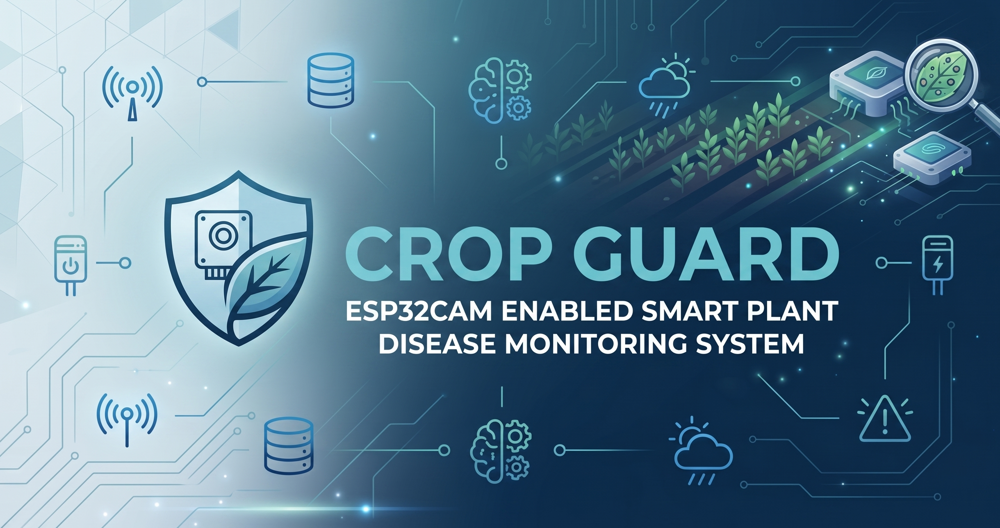
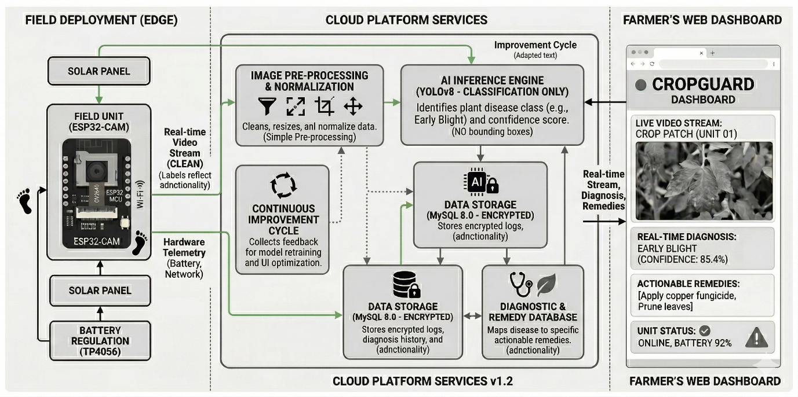
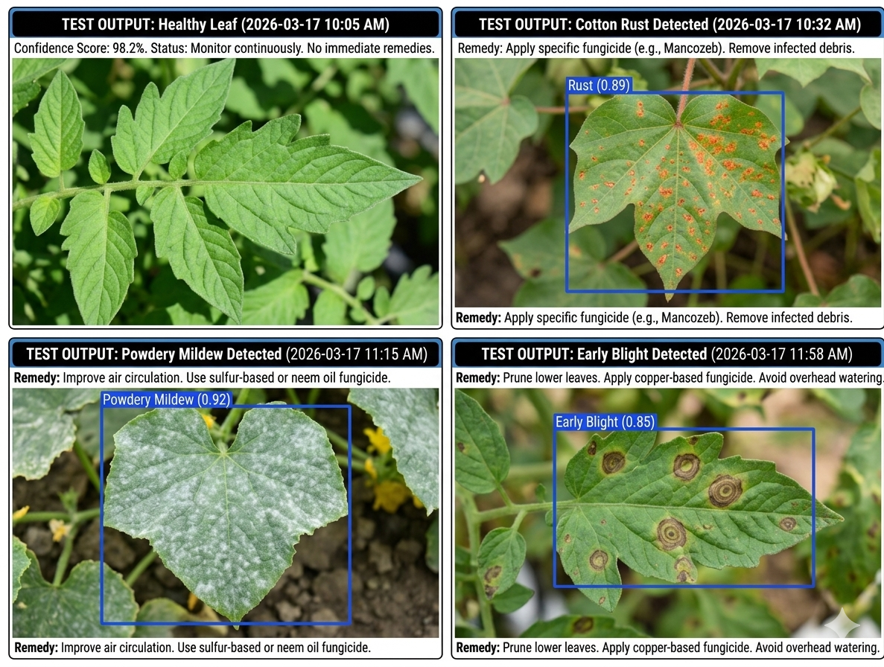

# CropGuard 🌱
A real-time, fully autonomous plant disease monitoring system combining edge hardware and computer vision.
 

## 📌 Overview
CropGuard is a cost-effective system designed to deliver high-accuracy, autonomous plant disease detection directly to farmers. The system integrates a single, low-power ESP32-CAM unit, deployed in the field and sustainably powered by a solar panel, to capture high-resolution images of plant leaves. It wirelessly transmits these images in real time to a cloud-based server where an optimized YOLOv8 object detection model identifies and localizes diseases with high accuracy. The centralized dashboard, powered by the iotbegineer platform, alerts farmers immediately and provides actionable remedies to treat the diseases.

## 🏗️ System Architecture
 
*(Add the architecture flowchart from your presentation here)*

## ✨ Features
* **Fully Autonomous & Solar Powered:** Continuously powered by a dedicated solar panel setup and battery management system.
* **Cloud-Offloaded Edge ML:** Uses YOLOv8 on a cloud server for rapid, high-precision disease identification and localization, avoiding slow on-device inference.
* **Actionable Remedies:** Cross-references detected diseases with a database to provide specific chemical or biological treatment plans.
* **Real-Time Web Platform:** Live feeds, historical reports, and alerts accessible via a user-friendly interface.

## 🛠️ Hardware Setup

*(Add the photo of your physical ESP32-CAM and solar panel baseboard here)*

The physical hardware acts as the central processing unit at the edge. The custom setup includes:
* ESP32-CAM Module (Microcontroller & OV2640 2MP Camera)
* Solar Panel
* Rechargeable Battery Pack
* Power Management Module (TP4056 charging circuit / Buck converters)
* FTDI Programmer (for initial flashing)
* Custom baseplate, toggle switches, and jumper wires

## 💻 Software & AI Stack
* **Computer Vision Model:** YOLOv8 (You Only Look Once, Version 8)
* **Architecture:** Convolutional Neural Networks (CNN) with Softmax Regression
* **Dataset:** Cloud-hosted custom plant disease image dataset
* **IoT Integration:** iotbegineer platform for data logging, stream buffering, and remote monitoring

## 📈 Dashboard & Results

*(Add the screenshot of your CropGuard web platform dashboard here)*

*(Add the image showing the bounding boxes on the diseased leaves here)*

## 📊 Performance Metrics
The system achieves excellent performance by offloading heavy processing to the cloud, significantly outperforming local edge-inference models:
* **Disease Detection Accuracy:** > 95.0%
* **System Uptime:** ~98% 
* **Cloud Data Streaming Latency:** ~2.4 seconds 
* **AI Inference Processing Speed:** ~180 milliseconds 

## 🚀 Future Scope
Continuous development aims to make the system more energy-efficient and user-friendly:
* **Environmental Sensors:** Integrating temperature, humidity, and soil moisture sensors to improve disease prediction accuracy.
* **Advanced Lightweight Models:** Deploying architectures like MobileNetV3 or EfficientNet to maintain precision while optimizing performance.
* **Large-Scale Farm Management:** Enhancing cloud and mobile application integration for broader remote monitoring.
* **Automated Alerts:** Adding SMS or push notification alerts for immediate intervention.

## 👥 Team
* Naveen Khumar S
* Sashangan K M
* Venkatesan R
